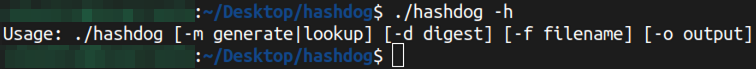
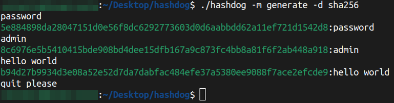
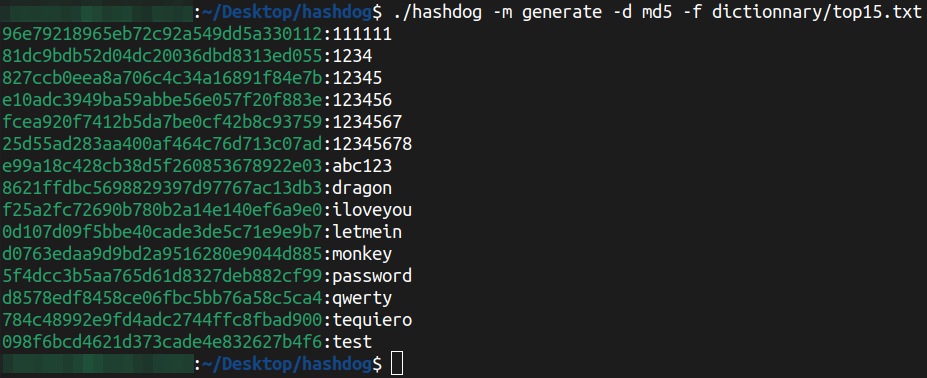
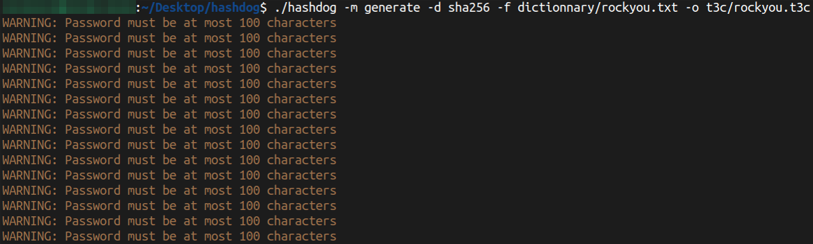
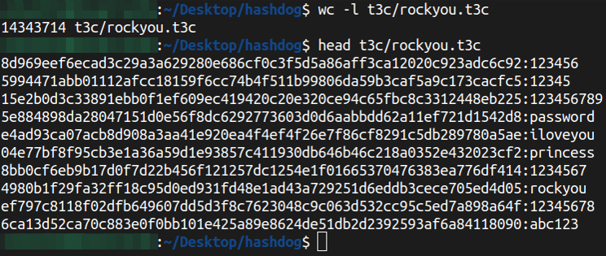
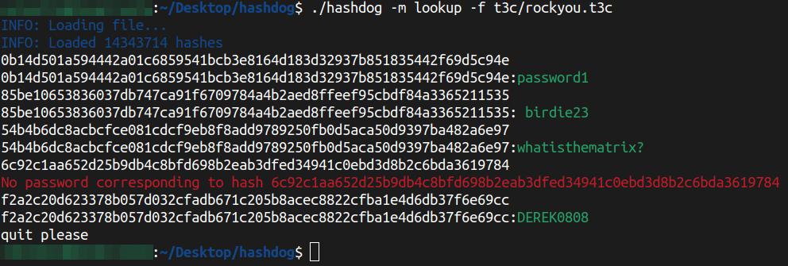

# Hashdog

 

## Installation guide

1. Install requirements :   `apt install gcc make libssl-dev`

2. Compile :   `make`

3. Run program :   `./hashdog -h`

 

## Docker usage

1. Build image :   `make docker_build` or `sudo docker build -t hashdog .`

2. Run container :    `make docker_run` or `sudo docker run -t -d --name hashdog hashdog`

3. Enter container :   `make docker_exec` or `sudo docker exec -it hashdog bash`

4. Run program : `./hashdog -h`

5. Stop container :   `make docker_stop` or `sudo docker stop hashdog`

6. Remove container :   `make docker_rm` or `sudo docker rm hashdog`

To remember :
- Copy file from host to container : `sudo docker cp <file> hashdog:/app/`
- Copy file from container to host : `sudo docker cp hashdog:/app/<file> .`

 

## Hashdog usage

Print help message :   `./hashdog -h`

Generate hashes from user input :   `./hashdog -m generate -d sha256` 

Generate hashes from dictionnary :   `./hashdog -m generate -d sha256 -f dictionnary/rockyou.txt`

Generate T3C from dictionnary :   `./hashdog -m generate -d sha256 -f dictionnary/rockyou.txt -o t3c/rockyou.t3c`

Load T3C file and lookup hashes :   `./hashdog -m lookup -f t3c/rockyou.t3c`

